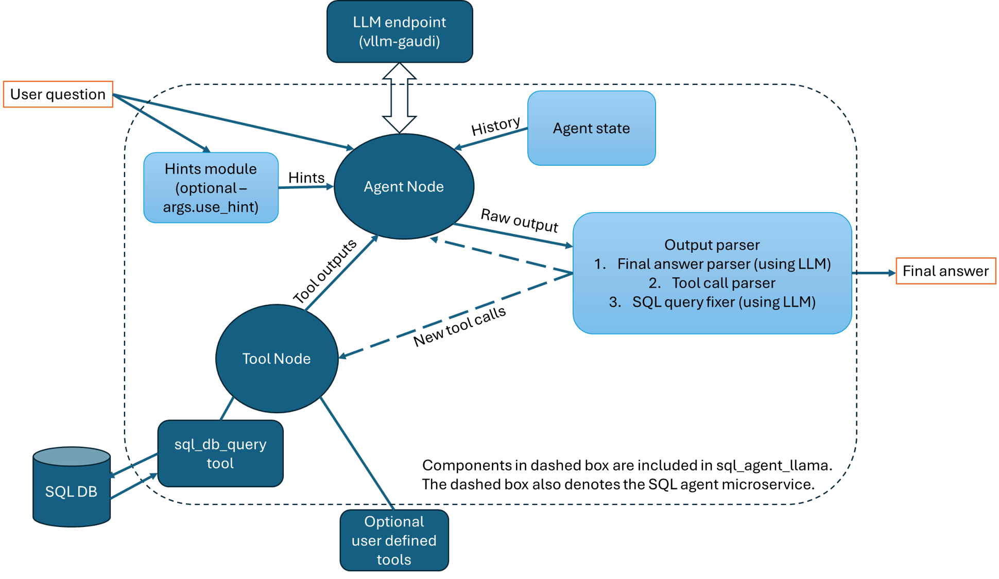

# SQL Agents

We currently have two types of SQL agents:

1. `sql_agent_llama`: for using with open-source LLMs, especially `meta-llama/Llama-3.1-70B-Instruct` model.
2. `sql_agent`: for using with OpenAI models, we developed and validated with GPT-4o-mini.

## Overview of sql_agent_llama

The architecture of `sql_agent_llama` is shown in the figure below.
The agent node takes user question, hints (optional) and history (when available), and thinks step by step to solve the problem.

### Database schema:

We use langchain's [SQLDatabase](https://python.langchain.com/docs/integrations/tools/sql_database/) API to get table names and schemas from the SQL database. User just need to specify `db_path` and `db_name`. The table schemas are incorporated into the prompts for the agent.

### Hints module:

If you want to use the hints module, you need to prepare a csv file that has 3 columns: `table_name`, `column_name`, `description`, and make this file available to the agent microservice. The `description` should include useful information (for example, domain knowledge) about a certain column in a table in the database. The hints module will pick up to five relevant columns together with their descriptions based on the user question using similarity search. The hints module will then pass these column descriptions to the agent node.

### Output parser:

Due to the current limitations of open source LLMs and serving frameworks (tgi and vllm) in generating tool call objects, we developed and optimized a custom output parser, together with our specially designed prompt templates. The output parser has 3 functions:

1. Decide if a valid final answer presents in the raw agent output. This is needed because: a) we found sometimes agent would make guess or hallucinate data, so it is critical to double check, b) sometimes LLM does not strictly follow instructions on output format so simple string parsing can fail. We use one additional LLM call to perform this function.
2. Pick out tool calls from raw agent output. And check if the agent has made same tool calls before. If yes, remove the repeated tool calls.
3. Parse and review SQL query, and fix SQL query if there are errors. This proved to improve SQL agent performance since the initial query may contain errors and having a "second pair of eyes" can often spot the errors while the agent node itself may not be able to identify the errors in subsequent execution steps.

## Overview of sql_agent

The architecture of `sql_agent` is shown in the figure below.
The agent node takes user question, hints (optional) and history (when available), and thinks step by step to solve the problem. The basic idea is the same as `sql_agent_llama`. However, since OpenAI APIs produce well-structured tool call objects, we don't need a special output parser. Instead, we only keep the query fixer.

## Limitations

1. Agent is only allowed to issue "SELECT" commands to databases, i.e., agent can only query databases but cannot update databases.
2. We currently does not support "stream" agent outputs on the fly for `sql_agent_llama`.
3. Users need to pass the SQL database URI to the agent with the `db_path` environment variable. We have only validated SQLite database connected in such way.

Please submit issues if you want new features to be added. We also welcome community contributions!
