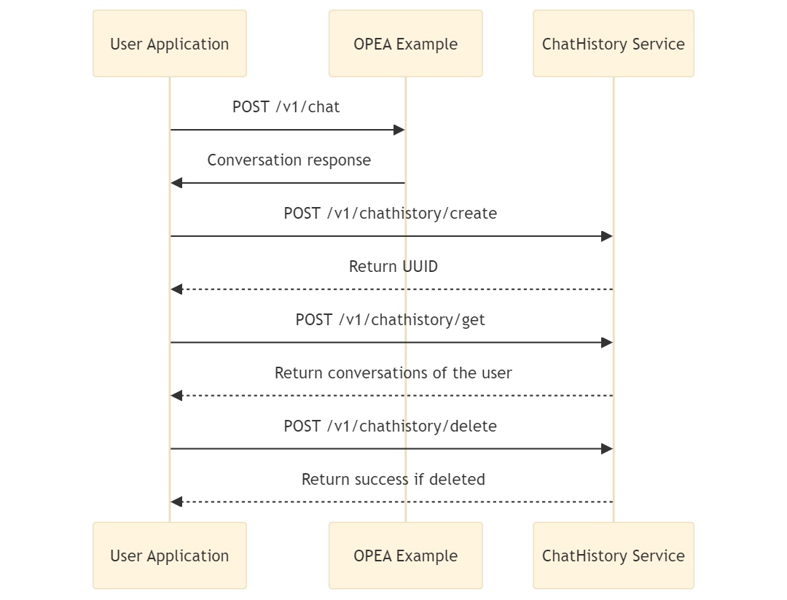

# Chat History Microservice

The Chat History Microservice allows you to store, retrieve and manage chat conversations with a MongoDB database. This microservice can be used for data persistence in OPEA chat applications, enabling you to save and access chat histories.

It can be integrated into any application by making HTTP requests to the provided API endpoints as shown in the flow diagram below.



## Setup Environment Variables

```bash
export http_proxy=${your_http_proxy}
export https_proxy=${your_http_proxy}
export MONGO_HOST=${MONGO_HOST}
export MONGO_PORT=27017
export DB_NAME=${DB_NAME}
export COLLECTION_NAME=${COLLECTION_NAME}
```

## 🚀Start Microservice with Docker

### Build Docker Image

```bash
cd ../../../../
docker build -t opea/chathistory-mongo-server:latest --build-arg https_proxy=$https_proxy --build-arg http_proxy=$http_proxy -f comps/chathistory/mongo/docker/Dockerfile .
```

### Run Docker with CLI

- Run mongoDB image

```bash
docker run -d -p 27017:27017 --name=mongo mongo:latest
```

- Run the chathistory Service

```bash
docker run -d --name="chathistory-mongo-server" -p 6013:6013 -p 6012:6012 -p 6014:6014 -e http_proxy=$http_proxy -e https_proxy=$https_proxy -e no_proxy=$no_proxy -e MONGO_HOST=${MONGO_HOST} -e MONGO_PORT=${MONGO_PORT} -e DB_NAME=${DB_NAME} -e COLLECTION_NAME=${COLLECTION_NAME} opea/chathistory-mongo-server:latest
```

## Invoke Microservice

Once chathistory service is up and running, users can update the database by using the below API endpoint. The API returns a unique UUID for the saved conversation.

```bash
curl -X 'POST' \
  http://${host_ip}:6012/v1/chathistory/create \
  -H 'accept: application/json' \
  -H 'Content-Type: application/json' \
  -d '{
  "data": {
    "messages": "test Messages", "user": "test"
  }
}'
```

- Get all the Conversations for a user

```bash
curl -X 'POST' \
  http://${host_ip}:6012/v1/chathistory/get \
  -H 'accept: application/json' \
  -H 'Content-Type: application/json' \
  -d '{
  "user": "test"}'
```

- Get specific conversation by specifying the id.

```bash
curl -X 'POST' \
  http://${host_ip}:6012/v1/chathistory/get \
  -H 'accept: application/json' \
  -H 'Content-Type: application/json' \
  -d '{
  "user": "test", "id":"668620173180b591e1e0cd74"}'
```

- Update the conversation by specifying the id.

```bash
curl -X 'POST' \
  http://${host_ip}:6012/v1/chathistory/create \
  -H 'accept: application/json' \
  -H 'Content-Type: application/json' \
  -d '{
  "data": {
    "messages": "test Messages Update", "user": "test"
  },
  "id":"668620173180b591e1e0cd74"
}'
```

- Delete a stored conversation by specifying the id.

```bash
curl -X 'POST' \
  http://${host_ip}:6012/v1/chathistory/delete \
  -H 'accept: application/json' \
  -H 'Content-Type: application/json' \
  -d '{
  "user": "test", "id":"668620173180b591e1e0cd74"}'
```
