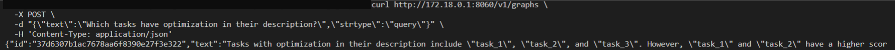

# Knowledge Graph Microservice

This microservice, designed for efficiently handling and retrieving informantion from knowledge graph. The microservice integrates text retriever, knowledge graph quick search and LLM agent, which can be combined to enhance question answering.

The service contains three modes:

- "cypher": Query knowledge graph directly with cypher
- "rag": Apply similarity search on embeddings of knowledge graph
- "query": An LLM agent will automatically choose tools (RAG or CypherChain) to enhance the question answering

Here is the overall workflow:


A prerequisite for using this microservice is that users must have a knowledge gragh database already running, and currently we have support [Neo4J](https://neo4j.com/) for quick deployment. Users need to set the graph service's endpoint into an environment variable and microservie utilizes it for data injestion and retrieve. If user want to use "rag" and "query" mode, still need a LLM text generation service (etc., TGI, vLLM and Ray) already running.

Overall, this microservice provides efficient support for applications related with graph dataset, especially for answering multi-part questions, or any other conditions including comples relationship between entities.

## 🚀1. Start Microservice with Docker

### 1.1 Setup Environment Variables

```bash
export NEO4J_ENDPOINT="neo4j://${your_ip}:7687"
export NEO4J_USERNAME="neo4j"
export NEO4J_PASSWORD=${define_a_password}
export HUGGINGFACEHUB_API_TOKEN=${your_huggingface_api_token}
export LLM_ENDPOINT="http://${your_ip}:8080"
export LLM_MODEL="meta-llama/Llama-2-7b-hf"
export AGENT_LLM="HuggingFaceH4/zephyr-7b-beta"
```

### 1.2 Start Neo4j Service

```bash
docker pull neo4j

docker run --rm \
    --publish=7474:7474 --publish=7687:7687 \
    --env NEO4J_AUTH=$NEO4J_USER/$NEO4J_PASSWORD \
    --volume=$PWD/neo4j_data:"/data" \
    --env='NEO4JLABS_PLUGINS=["apoc"]' \
    neo4j
```

### 1.3 Start LLM Service for "rag"/"query" mode

You can start any LLM microserve, here we take TGI as an example.

```bash
docker run -p 8080:80 \
    -v $PWD/llm_data:/data --runtime=habana \
    -e HABANA_VISIBLE_DEVICES=all \
    -e OMPI_MCA_btl_vader_single_copy_mechanism=none \
    -e HUGGING_FACE_HUB_TOKEN=$HUGGINGFACEHUB_API_TOKEN \
    --cap-add=sys_nice \
    --ipc=host \
    ghcr.io/huggingface/tgi-gaudi:2.0.0 \
    --model-id $LLM_MODEL \
    --max-input-tokens 1024 \
    --max-total-tokens 2048
```

Verify LLM service.

```bash
curl $LLM_ENDPOINT/generate \
  -X POST \
  -d '{"inputs":"What is Deep Learning?","parameters":{"max_new_tokens":32}}' \
  -H 'Content-Type: application/json'
```

### 1.4 Start Microservice

```bash
cd ../../../
docker build -t opea/knowledge_graphs:latest \
    --build-arg https_proxy=$https_proxy \
    --build-arg http_proxy=$http_proxy \
    -f comps/knowledgegraphs/langchain/Dockerfile .

docker run --rm \
    --name="knowledge-graph-server" \
    -p 8060:8060 \
    --ipc=host \
    -e http_proxy=$http_proxy \
    -e https_proxy=$https_proxy \
    -e NEO4J_ENDPOINT=$NEO4J_ENDPOINT \
    -e NEO4J_USERNAME=$NEO4J_USERNAME \
    -e NEO4J_PASSWORD=$NEO4J_PASSWORD \
    -e HUGGINGFACEHUB_API_TOKEN=$HUGGINGFACEHUB_API_TOKEN \
    -e LLM_ENDPOINT=$LLM_ENDPOINT \
    opea/knowledge_graphs:latest
```

## 🚀2. Consume Knowledge Graph Service

### 2.1 Cypher mode

```bash
curl http://${your_ip}:8060/v1/graphs \
  -X POST \
  -d "{\"text\":\"MATCH (t:Task {status:'open'}) RETURN count(*)\",\"strtype\":\"cypher\"}" \
  -H 'Content-Type: application/json'
```

Example output:


### 2.2 Rag mode

```bash
curl http://${your_ip}:8060/v1/graphs \
  -X POST \
  -d "{\"text\":\"How many open tickets there are?\",\"strtype\":\"rag\", \"max_new_tokens\":128}" \
  -H 'Content-Type: application/json'
```

Example output:


### 2.3 Query mode

First example:

```bash
curl http://${your_ip}:8060/v1/graphs \
  -X POST \
  -d "{\"text\":\"Which tasks have optimization in their description?\",\"strtype\":\"query\"}" \
  -H 'Content-Type: application/json'
```

Example output:


Second example:

```bash
curl http://${your_ip}:8060/v1/graphs \
  -X POST \
  -d "{\"text\":\"Which team is assigned to maintain PaymentService?\",\"strtype\":\"query\"}" \
  -H 'Content-Type: application/json'
```

Example output:

