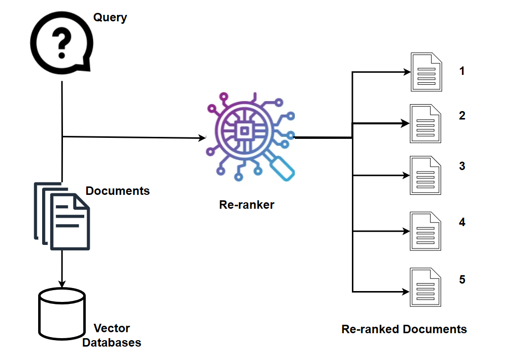

# Reranking Microservice

The Reranking Microservice, fueled by reranking models, stands as a straightforward yet immensely potent tool for semantic search.
When provided with a query and a collection of documents, reranking swiftly indexes the documents based on their semantic relevance to the query,
arranging them from most to least pertinent. This microservice significantly enhances overall accuracy. In a text retrieval system,
either a dense embedding model or a sparse lexical search index is often employed to retrieve relevant text documents based on the input.
However, a reranking model can further refine this process by rearranging potential candidates into a final, optimized order.

---

## 🛠️ Features

- **rerank on retrieved documents**: Perform reranking on the given documents using reranking models together with query.

---

## ⚙️ Implementation

### Utilizing Reranking with fastRAG

For additional information, please refer to this [README](./fastrag/README.md)

### Utilizing Reranking with Mosec

For additional information, please refer to this [README](./mosec/langchain/README.md)

### Utilizing Reranking with TEI

For additional information, please refer to this [README](./tei/README.md)

### Utilizing Reranking with VideoQnA

For additional information, please refer to this [README](./videoqna/README.md)
